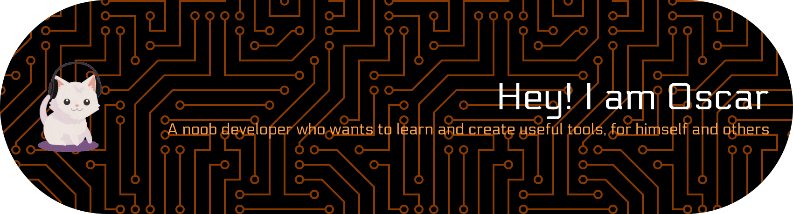

# ¡Hola! 👋

## Sobre mí
Soy Oscar, un apasionado de la tecnología y actualmente estoy cursando un Ciclo Superior de Desarrollo de Aplicaciones Multiplataforma. Estoy enfocado en mejorar mis habilidades en programación, en especial en **Java**. Estoy aprendiendo Java en el ciclo y Python(aunque lo aprenderemos en el ciclo a partir de segundo) lo estoy aprendiendo un poco por mi cuenta, esta es la cuenta que uso para los trabajos del ciclo, tengo otra de uso personal

---

## 💻 Lenguajes y Tecnologías

Aqui estaran los lenguajes que uso a nivel del ciclo que estoy estudiando en la actualidad en el ciclo formativo

  

  

  

  
 
  

---

## 📊 Estadísticas de GitHub

<!-- Para mostrar los lenguajes más usados, puedes usar: -->

---

## Objetivos
- 🌱 Actualmente aprendiendo: **Java** he empezado con la **Programacion Orientada a Objetos** en este lenguaje de forma personal y todavia no entiendo todo

---

¡No dudes en contactarme para colaborar o hablar sobre tecnología! 😊
